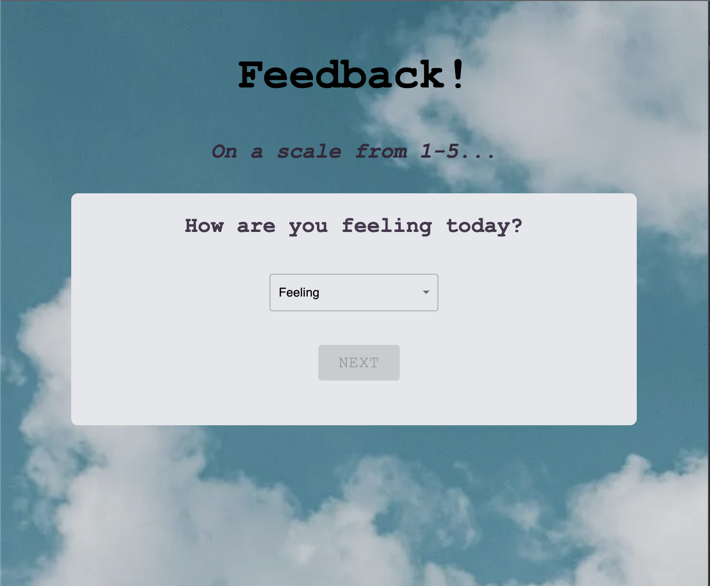

    
    
# Weekend Redux Feedback Loop

## Table of Contents

- [Description](#description)
- [Screenshots](#screenshots)
- [Built With](#built-with)
- [Getting Started](#getting-started)
  - [Prerequisites](#prerequisites)
  - [Installation](#installation)
- [Usage](#usage)
- [License](#license)
- [Acknowledgements](#acknowledgements)
- [Contacts](#contacts)

## Description

A reflection/feedback form. Feedback will be collected over 4 pages. In a separate review page, the app displays the selected feedback values and a submit button. and when all steps are complete, your app will save the feedback in the database.

## Screenshots

## Built With

## Getting Started

### Prerequisites

### Installation

"dependencies": {
        "@emotion/react": "^11.6.0",
        "@emotion/styled": "^11.6.0",
        "@material-ui/core": "^4.12.3",
        "@mui/icons-material": "^5.1.1",
        "axios": "^0.21.1",
        "express": "^4.17.1",
        "pg": "^8.2.1",
        "react": "^17.0.1",
        "react-bootstrap": "^2.0.2",
        "react-dom": "^17.0.1",
        "react-dropdown": "^1.9.2",
        "react-redux": "^7.2.6",
        "react-router-dom": "^6.0.2",
        "react-scripts": "^4.0.1",
        "redux": "^4.1.2",
        "redux-logger": "^3.0.6"
      }

## Usage

How do I use your project

## License

<a href="https://choosealicense.com/licenses/mit/">MIT License</a>

## Acknowledgements

Thank you to:
Prime Digital Academy &
Dev Jana

## Contacts

  